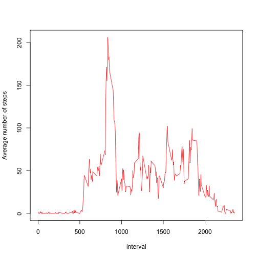
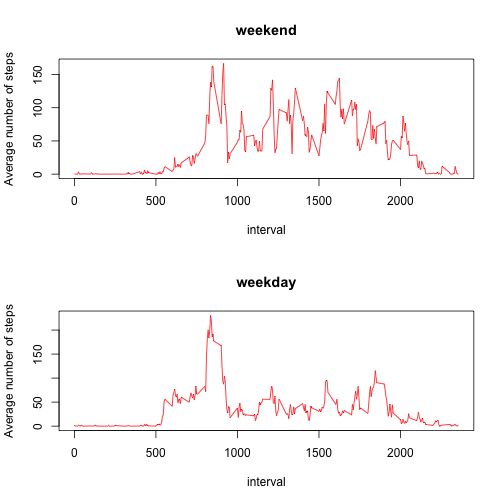

First, load the data


```r
dataAll <- read.csv("activity.csv")
```

Then create a version with all of the "NAs" filtered out


```r
dataNoNA <- na.omit(dataAll)
```

Make a histogram of the total number of steps taken each day


```r
sumSteps1 <- aggregate(steps ~ date, data = dataNoNA, FUN = sum)
hist(sumSteps1$steps)
```

 

Calculate the mean and median total number of steps taken per day


```r
dataMean1 <- mean(sumSteps1$steps)
dataMedian1 <- median(sumSteps1$steps)
```

The mean is 1.0766 &times; 10<sup>4</sup>, and the median is 10765.

Make a time series plot of the 5-minute interval (x-axis) and the average number of steps taken, averaged across all days (y-axis)


```r
aveSteps1 <- aggregate(steps ~ interval, data = dataNoNA, FUN = mean)
plot(aveSteps1$interval, aveSteps1$steps, xlab = "interval", ylab = "Average number of steps", type = "n")
lines(aveSteps1$interval, aveSteps1$steps, type = "l", col = "red")
```

 

compute which 5-minute interval, on average across all the days in the dataset, contains the maximum number of steps


```r
maxInterval <- aveSteps1[which.max(aveSteps1$steps), 1]
```

the interval is 835

Calculate the total number of missing values in the dataset,


```r
totalNA <- sum(is.na(dataAll$steps))
```

the total number of missing values in the dataset is 2304

Now we use the mean for the correponding 5-minute interval to filling in all of the missing values in the dataset, and create a new dataset that is equal to the original dataset but with the missing data filled in


```r
data <- dataAll
for (j in 1:nrow(data)) {
  if (is.na(data$steps[j])) { 
    data$steps[j] <- aveSteps1$steps[aveSteps1$interval == data$interval[j]]
  }
}
```

Make a histogram of the total number of steps taken each day


```r
sumSteps2 <- aggregate(steps ~ date, data = data, FUN = sum)
hist(sumSteps2$steps)
```

 

calculate the mean and median total number of steps taken per day


```r
dataMean2 <- mean(sumSteps2$steps)
dataMedian2 <- median(sumSteps2$steps)
```

the new mean is 1.0766 &times; 10<sup>4</sup> and the new median is 1.0766 &times; 10<sup>4</sup>, the new mean does not differ from the estimates from the first part of the assignment, but the new median doess differ a little, since we now used the 5-minute interval average for the missing values. The impact of imputing missing data on the estimates of the total daily number of steps is that now we have more data, and the histogram reflects that.

Create a new factor variable in the dataset with two levels - "weekday" and "weekend" indicating whether a given date is a weekday or weekend day.


```r
dates <- as.Date(data$date, "%Y-%m-%d")
weekday <- weekdays(dates, abbreviate = FALSE)
isWeekday <- c()
for (k in 1:nrow(data)) {
  if (weekday[k] == "Saturday" | weekday[k] == "Sunday") {
    isWeekday[k] <- "weekend"
  } else {
    isWeekday[k] <- "weekday"
  }
}
isWeekday <- factor(isWeekday)
data <- cbind(data, isWeekday)
```

Make a panel plot containing a time series plot of the 5-minute interval (x-axis) and the average number of steps taken, averaged across all weekday days or weekend days (y-axis).


```r
weekdayData <- subset(data, data$isWeekday == "weekday")
weekendData <- subset(data, data$isWeekday == "weekend")
aveSteps2 <- aggregate(steps ~ interval, data = weekdayData, FUN = mean)
aveSteps3 <- aggregate(steps ~ interval, data = weekendData, FUN = mean)
par(mfcol = c(2, 1))
plot(aveSteps3$interval, aveSteps3$steps, main = "weekend", xlab = "interval", ylab = "Average number of steps", type = "n")
lines(aveSteps3$interval, aveSteps3$steps, type = "l", col = "red")
plot(aveSteps2$interval, aveSteps2$steps, main = "weekday", xlab = "interval", ylab = "Average number of steps", type = "n")
lines(aveSteps2$interval, aveSteps2$steps, type = "l", col = "red")
```

 


